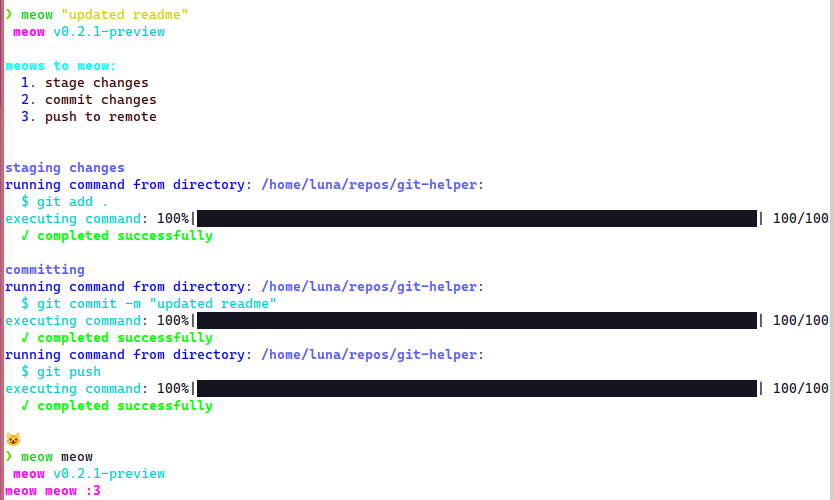

# meow
a git wrapper made in python

development takes place on the dev branch, main is for prod

## installation
run this: (untested for now)
```
curl -fsSL "https://raw.githubusercontent.com/ellipticobj/meower/refs/heads/main/install.sh" | sh
```

or download the latest file from [github releases](https://github.com/ellipticobj/meower/releases/latest)

## usage:
run `meow` to get detailed help

## building/installing locally
download dependencies:
```
pip install -r requirements.txt
```

build:
```
./build.sh
```

# screenshots
